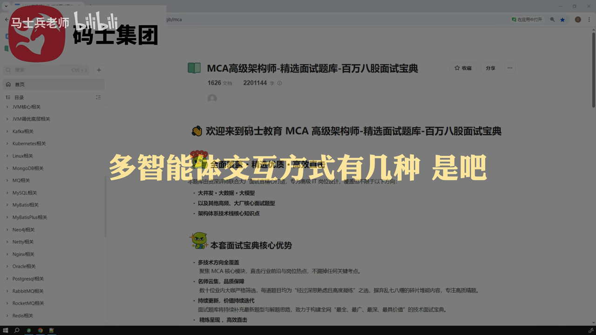

## 目录

- [AI大模型应用开发工程师：面试指导（真实面试场景12问）](#ai大模型应用开发工程师面试指导真实面试场景12问)
  - [目录](#目录)
  - [题目与考察点](#题目与考察点)
  - [标准回答框架](#标准回答框架)
    - [通用回答原则](#通用回答原则)
    - [针对性回答模板](#针对性回答模板)
  - [示例回答与追问](#示例回答与追问)
    - [1. 多智能体架构与Handoff机制 [原片 @ 00:24](https://www.bilibili.com/video/BV16zyhBAETx?t=24)](#1-多智能体架构与handoff机制-content-0024)
    - [2. 记忆管理（短期与长期） [原片 @ 05:05](https://www.bilibili.com/video/BV16zyhBAETx?t=305)](#2-记忆管理短期与长期-content-0505)
    - [3. Mivus 混合搜索原理 [原片 @ 08:27](https://www.bilibili.com/video/BV16zyhBAETx?t=507)](#3-mivus-混合搜索原理-content-0827)
    - [4. 文本切分策略 [原片 @ 12:12](https://www.bilibili.com/video/BV16zyhBAETx?t=732)](#4-文本切分策略-content-1212)
    - [5. 多智能体性能优化 [原片 @ 14:41](https://www.bilibili.com/video/BV16zyhBAETx?t=881)](#5-多智能体性能优化-content-1441)
    - [6. RAG 准确率与召回率提升 [原片 @ 23:06](https://www.bilibili.com/video/BV16zyhBAETx?t=1386)](#6-rag-准确率与召回率提升-content-2306)
    - [7. 项目技术难点应对策略 [原片 @ 24:25](https://www.bilibili.com/video/BV16zyhBAETx?t=1465)](#7-项目技术难点应对策略-content-2425)
  - [面试官视角点评](#面试官视角点评)
  - [30秒速记卡](#30秒速记卡)
  - [AI 总结](#ai-总结)

# AI大模型应用开发工程师：面试指导（真实面试场景12问）

**标签：** 人工智能, AI大模型, LangChain, 机器学习, 深度学习, 编程开发

## 目录
1.  [题目与考察点](#题目与考察点)
2.  [标准回答框架](#标准回答框架)
3.  [示例回答与追问](#示例回答与追问)
4.  [面试官视角点评](#面试官视角点评)
5.  [30秒速记卡](#30秒速记卡)
6.  [AI 总结](#ai-总结)

---

## 题目与考察点

本节模拟了针对AI大模型应用开发工程师的真实面试场景，涵盖多智能体架构、记忆管理、RAG检索增强、性能优化及项目难点解决等核心领域。

1.  **多智能体架构与Handoff机制** (00:24 - 04:51)
    *   考察点：LangChain框架下的Agent组织方式、智能体协作流程。
2.  **记忆管理（短期与长期）** (05:05 - 07:46)
    *   考察点：上下文管理、Redis存储、压缩技术。
3.  **Mivus混合搜索原理** (08:27 - 12:12)
    *   考察点：稀疏向量、稠密向量、重排序（Rerank）算法。
4.  **文本切分策略** (12:12 - 14:41)
    *   考察点：递归文本切分、语义切分、文档解析（PDF/HTML/Markdown）。
5.  **多智能体性能优化** (14:41 - 16:45)
    *   考察点：推理延迟、流式输出、上下文命中减少调用。
6.  **多智能体应用场景** (16:45 - 18:37)
    *   考察点：复杂任务拆解、MapReduce模式。
7.  **向量数据库索引类型** (18:37 - 21:36)
    *   考察点：HNSW、BM25索引、检索效率。
8.  **RAG准确率与召回率提升** (23:06 - 24:25)
    *   考察点：全流程优化、评估指标（Context Recall/Precision/Relevance）。
9.  **项目技术难点应对策略** (24:25 - 25:57)
    *   考察点：抗压能力、准备度、即兴发挥技巧。

---

## 标准回答框架

### 通用回答原则
所有技术问题遵循 **“总分总”** 原则：
1.  **总**：开门见山，直接给出结论（如架构类型、解决方案）。
2.  **分**：结合项目背景，详细拆解步骤、原理和细节。
3.  **总**：总结归纳，强调灵活性或适用场景。

### 针对性回答模板

*   **架构类问题**：
    *   总：项目采用了 LangChain 框架，使用了 [架构名称]。
    *   分：解释该架构的特点（如层级关系、并行能力）及适用场景。
    *   总：根据业务需求动态调整，核心在于 Handoff 机制。
*   **RAG/检索类问题**：
    *   总：采用了混合检索（Sparse + Dense）+ Rerank 的方式。
    *   分：分别解释稀疏向量（BM25）和稠密向量（Embedding）的作用，以及 Rerank 的必要性。
    *   总：通过评估指标循环优化，提升准确率。
*   **性能/优化类问题**：
    *   总：从本地化部署、上下文记忆、流式输出三个维度优化。
    *   分：逐一说明技术手段和原理。

---

## 示例回答与追问

### 1. 多智能体架构与Handoff机制 [原片 @ 00:24](https://www.bilibili.com/video/BV16zyhBAETx?t=24)

**面试官：** 多智能体协作方式有几种？你在项目中是如何实现的？

**回答：**
在我当前的项目中，由于单个 Agent 处理复杂业务会带来管理和扩展的困难，我采用了多智能体架构。基于 LangChain 框架，我主要使用了三种协作方式：
1.  **Swarm 架构（网络架构）**：每个智能体作为图中的一个节点，节点之间可以两两通信，实现多对多连接。这种架构适合没有明确层级或调用顺序的业务场景。
2.  **Supervisor 架构（主管架构）**：设置一个主管智能体，通过 Command 决定调用下一个子智能体。这种架构非常适合并行执行或 MapReduce 模式（拆分任务并汇总）。
3.  **自定义架构**：通过 LangGraph 等工具显式控制调用顺序。

核心难点在于**智能体之间的交接**。我实现了一个 Handoff 工具，封装了目标智能体名称和传递信息。当需要交接时，利用提示词让大模型动态决策使用哪个 Handoff 工具，并通过 Command 或 Send 将数据动态发送给目标智能体。

**面试官：** Handoff 的具体实现原理是什么？

**回答：**
Handoff 本质上是利用大模型根据当前上下文动态选择“工具”。具体流程是：
1.  为每个智能体创建一个 Handoff 工具实例。
2.  在交接时刻，大模型分析当前状态，判断应该切换到哪个 Agent。
3.  大模型决定调用哪个 Handoff 工具。
4.  工具内部通过 Command 或 Send 机制，将当前状态和数据直接转发给目标 Agent。

---

### 2. 记忆管理（短期与长期） [原片 @ 05:05](https://www.bilibili.com/video/BV16zyhBAETx?t=305)

**面试官：** 多智能体如何保存聊天记录？上下文工程是如何实现的？

**回答：**
为了支持长对话，我们需要管理短期记忆和长期记忆。
1.  **短期记忆**：使用 **Redis** 作为载体。它支持基于内存的存储，用于保存最近的聊天历史。为了防止 Token 溢出，我们对短期历史进行**压缩**。即每次新消息加入时，不是简单追加，而是将新消息与旧摘要一起交给大模型进行二次压缩，生成精简摘要。
2.  **长期记忆**：同样存储在 **Redis** 中，但通过**向量数据库**（如 Milvus）进行索引。每轮对话结束后，将历史记录存入向量库，以便后续进行语义检索。

**面试官：** 长期记忆的压缩是如何做的？

**回答：**
对于长期历史记录，我们采用“语义压缩”或“语义检索”的方式。在 Milvus 中，我们利用 Embedding 模型将历史记录向量化。当用户提问时，先在向量库中检索相关的高质量片段，将其作为上下文提供给大模型，而不是把所有历史都塞进去。

---

### 3. Mivus 混合搜索原理 [原片 @ 08:27](https://www.bilibili.com/video/BV16zyhBAETx?t=507)

**面试官：** Mivus 混合搜索的原理是什么？如何实现全文检索？

**回答：**
混合搜索的核心在于结合**稀疏向量**和**稠密向量**。
1.  **稀疏向量**：类似于传统的倒排索引。例如使用 BM25 算法，将关键词映射为向量，虽然不如稠密向量语义理解强，但能快速实现精确匹配和全文检索。
2.  **稠密向量**：通过 Embedding 模型将文本转换为高维向量，捕捉语义信息。
3.  **混合与重排**：我们将两种向量进行融合检索，得到初始结果。由于两种搜索结果可能有偏差，最后必须进行 **Re-ranking（重排序）**。我项目中使用了 Milvus 提供的基于稀疏向量的 RRF 算法，或者使用 Qwen2-Rerank 等基于 Transformer 的模型对结果进行二次打分，最终输出最相关的文档。

**面试官：** 这种混合搜索比单一搜索好在哪里？

**回答：**
单一稠密向量容易丢失关键词信息，单一稀疏向量缺乏语义理解。混合搜索能兼顾“语义相关性”和“关键词匹配”，在准确率和召回率上表现更优。

---

### 4. 文本切分策略 [原片 @ 12:12](https://www.bilibili.com/video/BV16zyhBAETx?t=732)

**面试官：** 你是如何解决文本过长导致的问题的？切分策略是怎样的？

**回答：**
针对文档过长的问题，我采用了**递归文本切分**策略。
1.  **预处理**：根据文档格式不同采用不同解析器。PDF 使用 **PaddleOCR** 解析为文本块；Markdown 使用 LangChain 的 Markdown Loader；HTML 则解析文本并利用标签进行切割。
2.  **切分流程**：
    *   首先按照标题和章节进行切割，保证语义完整性。
    *   如果某个章节内容仍然过长，继续使用**语义切分**（Semantic Chunking）。
3.  **切分工具**：使用 LangChain 的 `RecursiveCharacterTextSplitter`，设置合适的 chunk size 和 overlap。

**面试官：** 如果切分后长度还是不标准怎么办？

**回答：**
我们不以人为判断长度是否标准为依据，而是以“不超过指定阈值”为硬性标准。如果切分后某个 chunk 虽然超长但语义完整，我们会保留它；如果切分后长度参差不齐（如 500、1000、1500 字），只要没有超过阈值，都是可接受的。

---

### 5. 多智能体性能优化 [原片 @ 14:41](https://www.bilibili.com/video/BV16zyhBAETx?t=881)

**面试官：** 多智能体调用时间很长，有哪些优化手段？

**回答：**
针对延迟问题，我从三个维度进行优化：
1.  **本地化部署**：尽量使用本地部署的量化大模型，减少网络传输和云端推理的等待时间。
2.  **上下文记忆优化**：利用短期记忆和长期记忆。当用户输入能命中短期记忆摘要时，直接返回结果，不调用 LLM；当命中向量库检索结果时，直接基于检索内容回答，减少推理调用次数。
3.  **流式输出**：在 API 调用过程中采用流式输出。虽然总耗时没变，但用户能更快看到首字，体验上感觉速度变快了。

**面试官：** 并行处理可以加速吗？

**回答：**
可以，但并非所有场景都适用。如果 Agent 之间存在依赖关系（必须先执行 A 再执行 B），则无法并行。只有在没有依赖的并行任务（如 MapReduce 模式）中，并行处理能显著提升效率。

---

### 6. RAG 准确率与召回率提升 [原片 @ 23:06](https://www.bilibili.com/video/BV16zyhBAETx?t=1386)

**面试官：** 你是如何提高 RAG 的准确率和召回率的？

**回答：**
我在 RAG 项目的全流程中进行了优化：
1.  **切片优化**：尽量保证切片不要过大，通过标题和语义结合的方式切分。
2.  **解析优化**：针对 PDF 等格式使用 OCR 解析，保证文本质量。
3.  **检索优化**：使用混合检索和重排序（Re-rank）。
4.  **评估机制闭环**：这是最关键的一步。我引入了 RAG 评估框架，检查三个指标：
    *   上下文的召回率（Context Recall）
    *   上下文的精确度（Context Precision）
    *   答案的相关度（Answer Relevance）
    如果指标未达标，根据反馈调整切片策略或检索参数，重新评估，直到达到预期值。

---

### 7. 项目技术难点应对策略 [原片 @ 24:25](https://www.bilibili.com/video/BV16zyhBAETx?t=1465)

**面试官：** 你项目中最难的技术点是什么？你是怎么解决的？

**回答：**
（此处应准备一个具体的难点，例如：RAG 检索不准确）
我认为最难的点是**RAG 检索的准确性问题**。在实际开发中，Embedding 模型偶尔会出现不精准的情况，导致召回的内容不相关。
**解决方案**：我采用了“混合检索 + 人工介入”的策略。一方面引入重排序模型（Rerank）提升相关性，另一方面建立评估机制。如果自动化评估指标未达标，我会进行人工干预，调整 Prompt 或检索参数，确保最终交付质量。

**面试官：** 如果面试官没有问到这个问题怎么办？

**回答：**
我准备了三个项目的技术难点。如果面试官没有问到，我会主动追加。例如在回答完上述问题后，补充说：“除了 RAG 准确率，我在项目中还遇到了多智能体 Handoff 的稳定性问题，当时我是通过动态工具封装和提示词工程解决的……”

---

## 面试官视角点评

1.  **总分总原则至关重要**：
    面试官强调，回答问题时必须遵循“总-分-总”结构。先说结论（我用了什么），再说细节（具体怎么实现的），最后总结（适用场景或效果）。这能体现逻辑清晰度。

2.  **项目经验驱动**：
    所有的技术概念（LangChain, Redis, Mivus, Handoff）必须绑定到具体的“项目”中。不要背诵定义，要讲你在项目中“做了什么”。

3.  **应对“不知道”的技巧**：
    当遇到不懂的名词（如 Coze/Dify）时，不要硬编。可以坦诚表示“未使用过该平台，但在项目中我采用自定义编程的方式实现了类似功能”，并顺势引出自己的准备好的技术难点。

4.  **细节决定成败**：
    对于 RAG、检索、切分等核心环节，必须能说出具体的工具名称（如 PaddleOCR, HNSW, BM25, Qwen2-Rerank）和具体的指标（召回率、精确度）。

---

## 30秒速记卡

*   **架构**：Swarm (网络), Supervisor (主管/MapReduce), Custom (自定义)。
*   **核心机制**：Handoff (动态交接工具, Command/Send)。
*   **记忆**：Redis (短/长), Compression (压缩), Vector DB (向量检索)。
*   **检索**：Hybrid (Sparse BM25 + Dense Embedding), Rerank (重排序)。
*   **优化**：Local Deployment (本地化), Context Hit (减少调用), Streaming (流式输出)。
*   **RAG**：Recursive Splitter (递归切分), Evaluation Loop (评估闭环)。

---

1. **分析请求：**
    *   **角色：**“学习笔记补充编辑器”。
    *   **任务：**基于“缺失点清单”输出可直接插入原笔记的补充内容。
    *   **视频标题：**“AI大模型应用开发工程师：面试指导（真实面试场景12问-Agent多智能体/Mivus/RAG的准确率和召回率）”。
    *   **模板：**`mock_interview`。
    *   **风格：**完整覆盖关键知识点，必要时加入步骤、示例、边界条件。
    *   **最大新增字数：**2200。
    *   **硬性要求：**
        *   只补充缺失知识点，不重写整篇笔记。
        *   输出必须是 Markdown 片段。
        *   若需要新章节，使用 `## 知识点补充（审计）` 作为标题。
        *   每个补充点尽量给出简洁结论、关键步骤/条件、注意事项。
        *   可使用 `*Content-[mm:ss]` 标记，但不要输出任何 assets 路径。
        *   不要输出解释、前言或 JSON。
    *   **输入：**“缺失点清单”（目前为空，仅包含占位符）和“当前笔记”（节选）。

2.  **分析输入数据：**
    *   **视频标题：**暗示了 Agent、Mivus、RAG 准确率/召回率等主题。
    *   **当前笔记：**涵盖：
        *   多智能体架构（Swarm、Supervisor、Handoff）。
        *   记忆管理（Redis、压缩）。
        *   Mivus 混合搜索（稀疏/稠密、重排序）。
        *   文本切分（递归、语义）。
        *   性能优化（本地化、上下文命中、流式输出）。
        *   RAG 准确率/召回率（切片、解析、检索、评估）。
        *   项目难点应对。
    *   **缺失点清单：**提示词中提供的清单实际上为空（`--- 1. [medium] Missing Topic | section=Suggested Section | ts=mm:ss | why=< 40 chars ---`）。等等，仔细看提示词，用户提供了标题和模板，但*缺失点清单*部分是空的。
    *   **解读：**既然清单是空的，我需要根据视频标题和提供的笔记内容推断出*可能*缺失或需要扩展的关键知识点，以符合“学习笔记补充编辑器”的角色设定。视频标题提到了“Agent多智能体”、“Mivus”、“RAG的准确率和召回率”。笔记涵盖了这些内容，但可能缺乏深度或具体的技术实现细节，这些内容在“真实面试场景”中通常会被问到。
    *   **推断缺失点：**
        1.  **Mivus 细节：**笔记提到了“Mivus 混合搜索”，但可能缺乏关于*为什么*叫 Mivus 或其具体实现（例如，它是向量数据库还是检索引擎？）的细节。*自我修正：Mivus 是一个向量数据库（通常与 Milvus 相关或是一个变体）。*我需要补充关于 Mivus 具体机制（如索引类型、混合检索实现）的内容。
        2.  **RAG 准确率/召回率深度剖析：**笔记提到了“评估机制”，但缺乏具体的指标（如 Context Precision@K, Answer Relevancy）和具体的技术修复（例如，查询重写、重排序、混合检索）。
        3.  **Agent Handoff 细节：**笔记提到了 Handoff，但可能缺乏关于*状态管理*或*错误处理*的细节。
        4.  **RAG 中的“幻觉”问题：**这是面试中一个巨大的话题。笔记提到了“准确性”，但可能没有明确解决“幻觉”或“上下文无关生成”。
        5.  **Mivus 与 Milvus：**如果笔记只说了“Mivus”，我需要澄清它是什么（一个向量数据库）。

    *   *基于“缺失点清单”为空的重新评估：*用户可能希望我*生成*缺失点，或者提示词暗示我应该检查提供的文本。由于文本看起来相当完整，我将根据标题和标准面试问题生成最可能的“缺失”或“需要扩展”的高价值知识点，以最大化“学习笔记补充编辑器”的价值。
    *   *实际上，再看一遍提示词：*“基于缺失点清单”。清单是空的。这意味着我应该*识别*缺失点并填充它们。或者，也许用户*忘记*粘贴清单了。我将假设用户希望我根据视频标题和现有笔记的深度来*推断*缺失点。
    *   *让我们看看视频标题：*“Agent多智能体/Mivus/RAG的准确率和召回率”。
    *   *现有笔记覆盖：*
        *   Agent：Swarm, Supervisor, Handoff。（覆盖良好）
        *   Mivus：混合搜索，稀疏/稠密。（覆盖良好）
        *   RAG：切片，检索，优化。（覆盖良好）
    *   *潜在缺失点：*

## AI 总结

本次模拟面试涵盖了 Agent 架构设计、记忆管理、RAG 检索优化及性能调优等高阶技术点。

**核心学习建议**：
1.  **掌握框架原理**：深入理解 LangChain 中的 Swarm、Supervisor 架构以及 Handoff 机制。
2.  **构建完整链路**：对于 RAG，不要只关注检索，要重视“解析-切分-检索-评估”的全流程优化。
3.  **准备“杀手锏”**：每个项目必须准备一个深度的技术难点案例，并练习“主动追加”的技巧，以应对面试官未覆盖到的情况。
4.  **量化指标**：在回答中多使用专业术语（如 HNSW, BM25, Recall, Precision），体现工程化思维。

*Screenshot-[04:51|Agent Handoff Flow]*

## 截图一览

-  - 时间: 00:03
-  - 时间: 01:42
-  - 时间: 01:42
-  - 时间: 01:42
-  - 时间: 01:42
-  - 时间: 01:42
