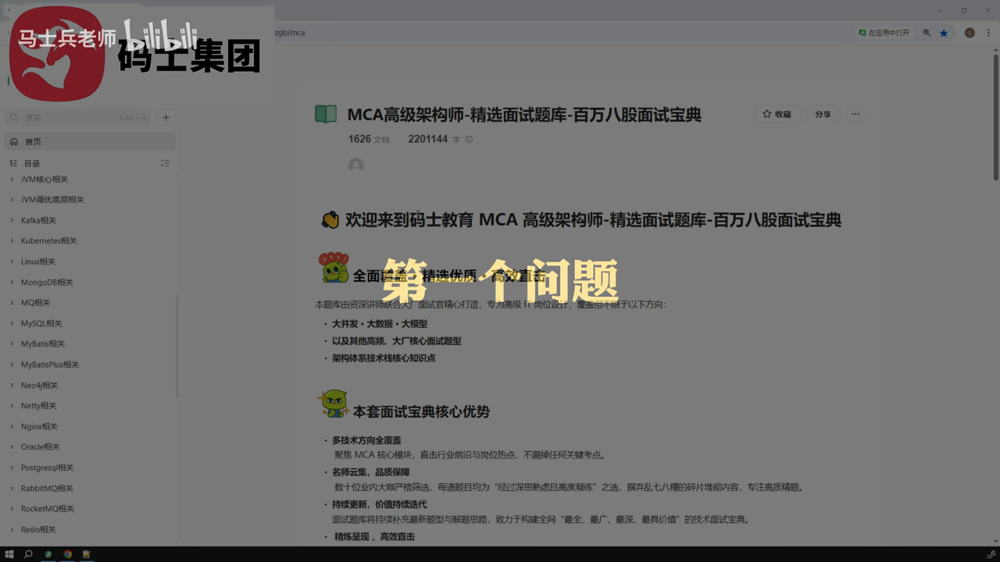
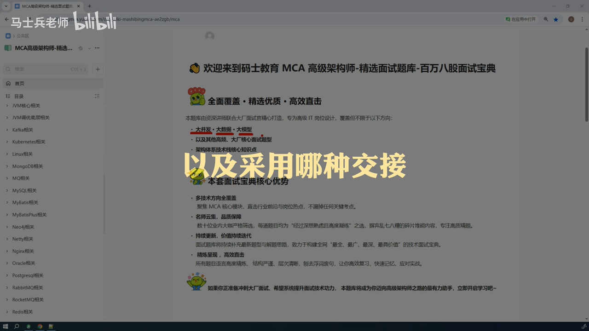
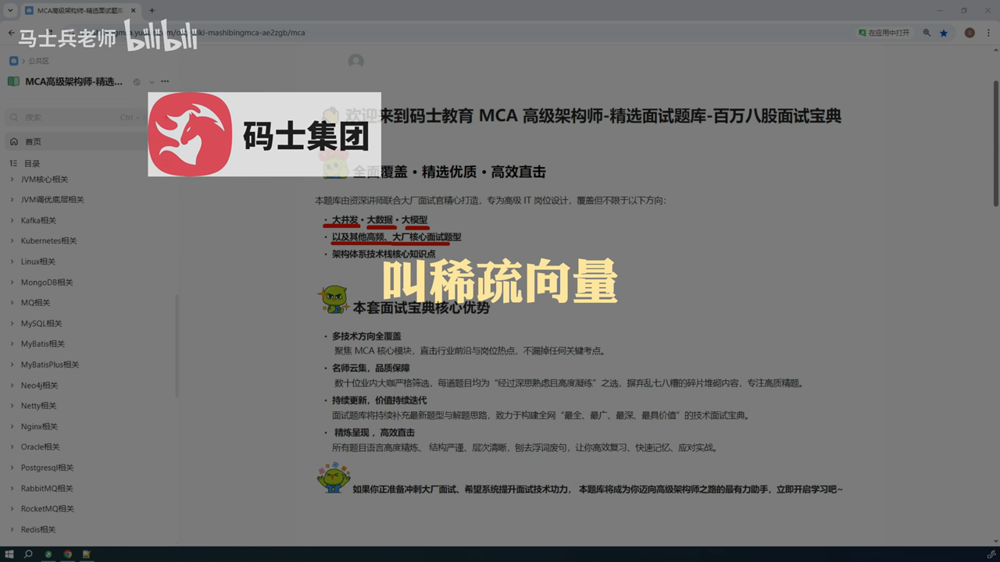
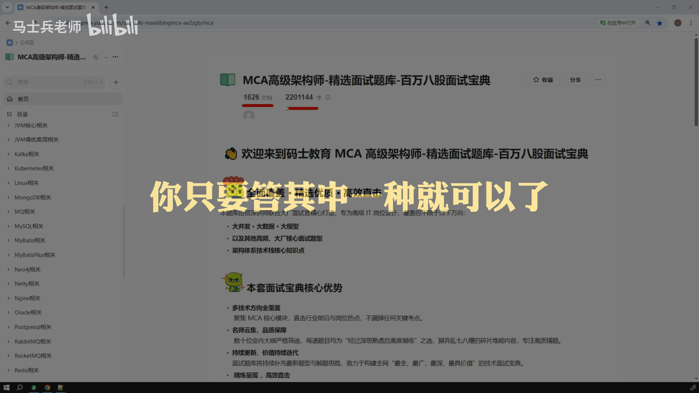
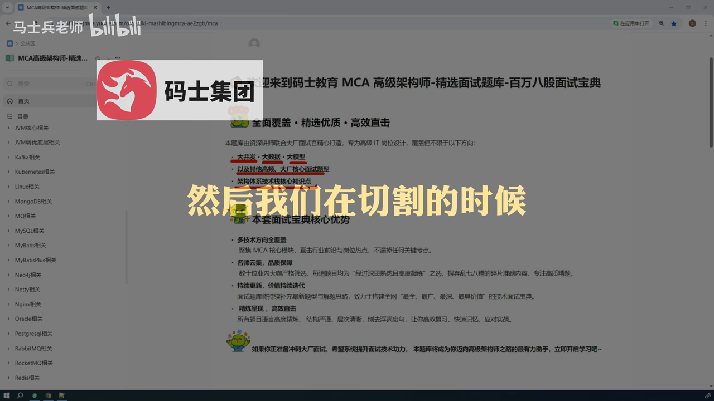
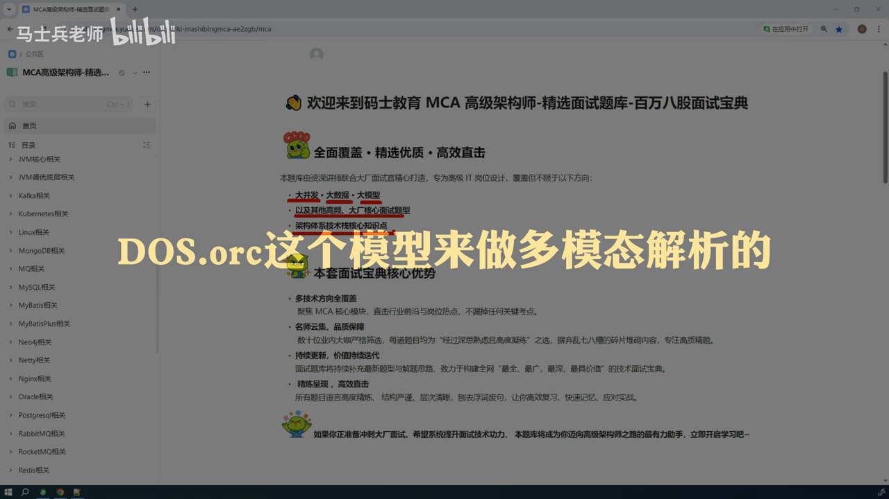

## 目录

  - [自动目录](#自动目录)
  - [题目与考察点](#题目与考察点)
  - [标准回答框架](#标准回答框架)
  - [示例回答与追问](#示例回答与追问)
  - [面试官视角点评](#面试官视角点评)
  - [30 秒速记卡](#30-秒速记卡)
  - [AI 总结](#ai-总结)

## 自动目录

- 题目与考察点
- 标准回答框架
- 示例回答与追问
- 面试官视角点评
- 30 秒速记卡
- AI 总结

## 题目与考察点

[原片 @ 00:25](https://www.bilibili.com/video/BV16zyhBAETx?t=25)
- **多智能体交互方式**：考察多智能体架构中不同交互模式的原理与应用场景，要求结合项目经验说明具体实现。
- **聊天历史保存**：考察RAG（检索增强生成）中聊天历史数据的存储策略，包括短期与长期存储机制。
- **混合检索原理**：考察向量数据库（如Minis）中混合检索（西出项量+密集项量）的实现原理与流程。
- **多智能体响应时间优化**：考察多智能体系统中响应延迟的优化方法，如本地化部署、缓存策略等。
- **文章切割方法**：考察文档处理中文章切割的自动化手段，如基于标题、章节或语义的切割。
- **多模态文档处理**：考察多模态（PDF、Markdown、HTML）文档解析与处理的流程。
- **多智能体交接原理**：考察多智能体间数据交接（Handoff）的机制与流程。
- **提高准确率和召回率**：考察RAG系统中通过多步骤优化（如切割、检索、重排、评估）提升性能的方法。
- **技术难点与解决方案**：考察项目中遇到的技术挑战及解决思路，体现问题分析与解决能力。

## 标准回答框架

[原片 @ 00:08](https://www.bilibili.com/video/BV16zyhBAETx?t=8)
1. **总-分-总结构**：先总体描述问题，再分点说明具体内容，最后总结。
2. **结合项目经验**：以实际项目为例，说明技术选择的原因（如业务需求、技术限制）。
3. **关键术语准确**：使用专业术语（如Swarm、Swarm Wiser、Handoff、RAG等），确保术语正确。
4. **逻辑清晰**：分点阐述时，逻辑连贯，从原理到应用逐步展开。

## 示例回答与追问

[原片 @ 00:29](https://www.bilibili.com/video/BV16zyhBAETx?t=29)
- **问题**：多智能体交互方式有几种？
- **回答**：
  按照总-分-总原则，首先说明在项目中采用多智能体架构是为了解决单Agent复杂度与管理问题。根据Nangrao框架，主要有三种交互方式：
  1. **Swarm架构（网络架构）**：每个Agent作为图节点，支持多对多通信，适合无明确层级或调用顺序的业务场景。
  2. **Swarm Wiser架构（主管架构）**：设置主管Agent决定后续调用，适合MapReduce模式（如拆分任务并行处理）。
  3. **自定义架构**：根据需求自定义Agent调用顺序，可通过图编辑或Command语义动态控制。
  项目中采用Swarm Wiser架构，需安装Languart库；交接机制（Handoff）通过动态决策工具实现。
- **追问**：项目中如何实现Handoff？
- **回答**：使用封装的Handoff工具，通过提示词动态选择目标Agent和传递信息，利用Command/Send元数据完成数据移交。

## 面试官视角点评

[原片 @ 01:17](https://www.bilibili.com/video/BV16zyhBAETx?t=77)
- **优点**：结构清晰，结合项目经验，术语准确，覆盖三种交互方式的核心特点。
- **不足**：对Handoff的具体实现细节（如工具封装、动态决策逻辑）可进一步展开，增强技术深度。

## 30 秒速记卡

[原片 @ 01:15](https://www.bilibili.com/video/BV16zyhBAETx?t=75)
- 多智能体交互：Swarm（网络）、Swarm Wiser（主管）、自定义（动态控制）。
- 聊天历史：短期（短期存储）+长期（长期存储），均用Redis存储。
- 混合检索：Minis中结合西出项量（Bm25）与密集项量（HNSW），通过Re-Rank优化结果。
- 响应优化：本地化部署、缓存短期/长期存储、流式输出。
- 文章切割：标题+章节切割，超长文本用语义切割。
- 多模态处理：PDF用DOS.orc解析，Markdown用markdown类，HTML按标签切割。
- 交接机制：动态Handoff工具，通过Command/Send传递数据。
- 性能优化：切割、检索、重排、评估多步骤，人工介入未达预期时干预。
- 技术难点：多智能体复杂度，通过架构分层（Swarm Wiser）解决。

## AI 总结
[原片 @ 25:00](https://www.bilibili.com/video/BV16zyhBAETx?t=1500)
多智能体架构需根据业务场景选择交互方式（Swarm/主管/自定义），聊天历史分短期（Redis缓存）与长期（数据库）存储，混合检索结合向量与文本检索（Minis），响应优化通过本地化与缓存，文档处理需多模态解析，交接依赖动态Handoff，性能提升需多步骤优化（切割、检索、重排、评估）。面试中应结合项目经验，突出技术选型逻辑与解决思路，强化问题分析与落地能力。

## 截图一览

-  - 时间: 00:02
-  - 时间: 04:59
-  - 时间: 09:18
-  - 时间: 13:08
-  - 时间: 17:58
-  - 时间: 22:13
