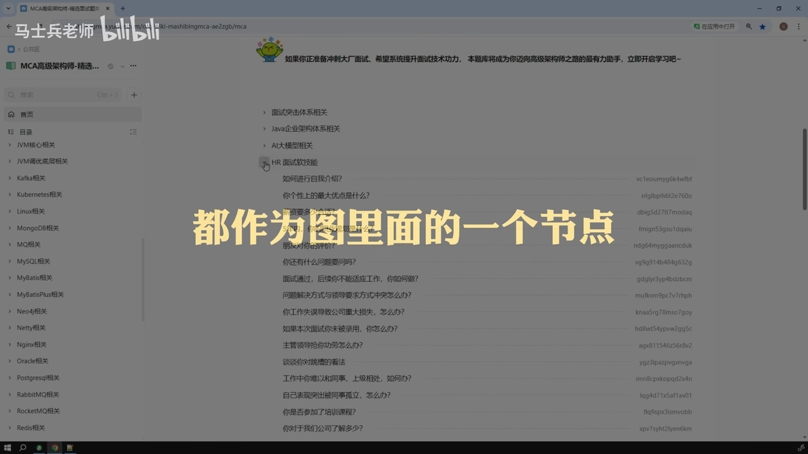

## 目录

- [目录](#目录)
  - [题目与考察点](#题目与考察点)
  - [标准回答框架](#标准回答框架)
  - [示例回答与追问](#示例回答与追问)
    - [多智能体架构与交接 [原片 @ 00:00](https://www.bilibili.com/video/BV16zyhBAETx?t=0)](#多智能体架构与交接-content-0000)
    - [多智能体记忆管理 [原片 @ 05:05](https://www.bilibili.com/video/BV16zyhBAETx?t=305)](#多智能体记忆管理-content-0505)

# 目录
- [题目与考察点](#题目与考察点)
- [标准回答框架](#标准回答框架)
- [示例回答与追问](#示例回答与追问)
    - [多智能体架构与交接](#多智能体架构与交接content-0000)
    - [多智能体记忆管理](#多智能体记忆管理content-0505)
    - [Milvus 混合检索与重排](#milvus-混合检索与重排content-0815)
    - [文档切割策略](#文档切割策略content-1212)
    - [多智能体性能优化](#多智能体性能优化content-1441)
    - [RAG 评估与迭代](#rag-评估与迭代content-2310)
- [面试官视角点评](#面试官视角点评)
- [30 秒速记卡](#30-秒速记卡)
- [AI 总结](#ai-总结)

## 题目与考察点

本课程针对 AI 大模型应用开发工程师岗位，梳理了面试中高频出现的技术难点。主要考察点包括：
1.  **多智能体架构**：掌握 LangGraph 中的不同编排模式及 Agent 间的交接机制。
2.  **记忆管理**：理解短期与长期记忆的存储策略及增量摘要实现。
3.  **RAG 检索优化**：深入理解混合检索原理、稀疏与密集向量的结合及重排序策略。
4.  **文档处理**：掌握语义切割的原理、实现及针对不同格式文档的解析策略。
5.  **性能优化**：多 Agent 场景下的响应延迟优化手段。
6.  **系统评估**：利用 RAGAS 等框架进行检索准确率与召回率的评估闭环。

## 标准回答框架

在回答此类技术问题时，建议遵循以下原则：
1.  **总分总原则**：先总体描述概念或方案，分点阐述细节，最后总结适用场景或项目落地情况。
2.  **项目关联原则**：每个技术点尽量结合简历中实际项目的具体实现进行描述，避免空谈理论。
3.  **结构化表达**：使用“第一、第二、第三”或“首先、其次、最后”等连接词，确保逻辑清晰。

## 示例回答与追问

### 多智能体架构与交接 [原片 @ 00:00](https://www.bilibili.com/video/BV16zyhBAETx?t=0)
**问题**：多智能体交互方式有几种？请结合项目说明。

**示例回答**：
在我的项目中，随着业务复杂度增加，单个 Agent 管理困难，因此采用了多智能体架构。基于 LangGraph 框架，主要有三种交互方式：
1.  **Swarm 组成模式（网络模式）**：每个 Agent 作为图节点，支持多对多通信。适用于无明确层级和调用顺序的场景。
2.  **Supervisor 主管模式**：设置一个主管节点，通过 Command 语义动态路由到子节点。特别适合并行处理或 MapReduce（分拆汇总）模式。
3.  **自定义模式**：通过编程显式控制调用顺序，或利用 Command 语义动态控制。

**关键难点：Agent 交接**
在项目中，Agent 间的交接是最难的部分。我们采用了 **Handoff 机制**：
*   **工具封装**：为每个 Agent 动态创建 Handoff 工具，封装目标 Agent 名字和传递信息。
*   **动态决策**：利用提示词和大模型动态决定使用哪个 Handoff 工具。
*   **数据传递**：通过 Command 和 Send 语法，在移交期间直接向目标 Agent 动态发送数据。

**追问**：Handoff 过程中如何保证上下文不丢失？
**回答**：Handoff 工具中封装了需要传递给目标 Agent 的完整上下文信息，确保交接时数据流的连续性。

### 多智能体记忆管理 [原片 @ 05:05](https://www.bilibili.com/video/BV16zyhBAETx?t=305)
**问题**：多智能体如何保存聊天历史？摘要功能

## 截图一览

-  - 时间: 00:03
-  - 时间: 01:42
-  - 时间: 01:42
